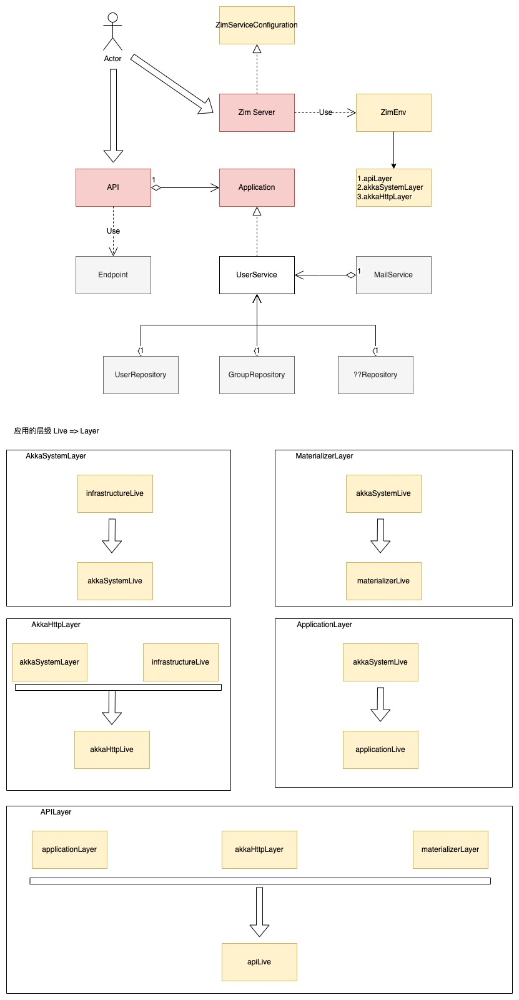

# zim
[](https://github.com/bitlap/zim/actions/workflows/ScalaCI.yml)
[](https://codecov.io/gh/bitlap/zim)

[English](./README_EN.md)

[更多详情，前往文档](https://bitlap.org/zh-CN/lab/zim)

## 项目结构

```
zim-master
├─ .github
│    └─ workflows   
│           └─ ScalaCI.yml                      -- GitHub action 配置
│           └─ auto-approve.yml
│           └─ autoupdate.yml             
├─ .gitignore
├─ .jvmopts
├─ .mergify.yml                                 -- 自动PR合并工具mergify的配置
├─ prepare.sh                                   -- 辅助脚本
├─ .scalafmt.conf                               -- scalafmt格式化插件配置
├─ LICENSE
├─ README.md
├─ build.sbt                                    -- sbt项目基础构建配置
├─ project
│    ├─ BuildInfoSettings.scala                 -- 用于编译期间生成项目全局信息的配置
│    ├─ Dependencies.scala                      -- 项目依赖和版本号配置
│    ├─ build.properties                        -- sbt版本
│    └─ plugins.sbt                             -- 项目所依赖的插件配置
└─ src
       └─ main
          ├─ resources
          │    ├─ application.conf.example      -- 数据库和服务配置模板
          │    └─ logback.xml                   -- 日志配置
          └─ scala
             └─ org
                └─ bitlap
                   └─ zim
                      ├─ ZimServer.scala        -- 程序入口，项目启动的main方法
                      ├─ actor                  -- actor和im ws的协议
                      ├─ api                    -- 基于tapir的API（基于akka http）和Endpoint定义
                      ├─ application            -- zio项目模块管理，聚合了service
                      ├─ cache                  -- 缓存 基于zio-redis
                      ├─ configuration          -- zio集成各框架的项目配置
                      ├─ domain                 -- 领域对象或其他简单的样例类
                         └─ model               -- 数据表对象
                      └─ repository             -- scalikejdbc的dao层实现（基于scalikejdbc stream和zio stream）
                      └─ util                   -- 工具类，经过zio包装
       └─ test
          ├─ resources
          │    ├─ application.conf                       -- 单测用的数据库和服务配置
          │    └─ logback-test.xml                       -- 单测用的日志配置
          └─ scala
             └─ org
                └─ bitlap
                   └─ zim
                      ├─ application                     -- 服务层的单测
                      ├─ RandomData.scala                -- 造用户表数据的代码
                      ├─ BaseData.scala                  -- 用于单测的通用封装父类
                      ├─ infrastructure.repository       -- repository单元测试
                      ├─ application                     -- application单元测试
                                          
```

## 项目组织结构

> 粗略图


