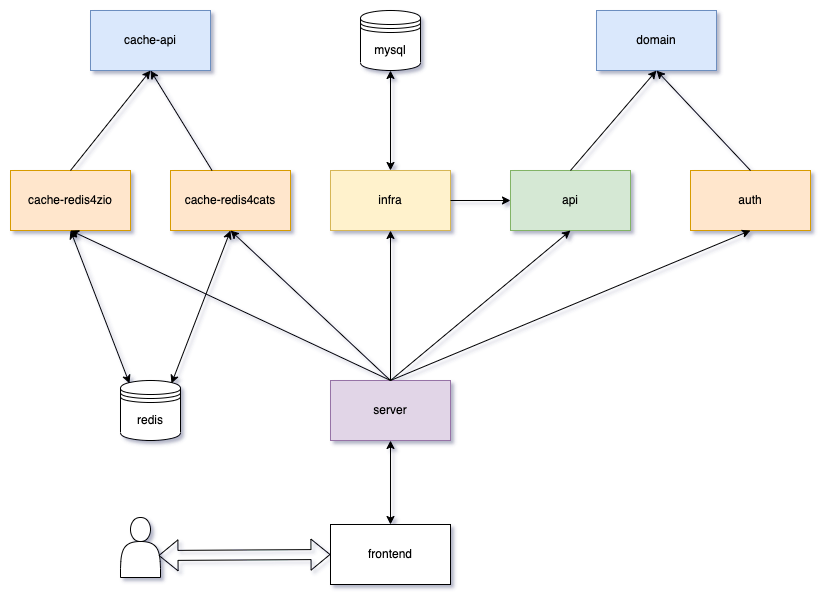

# zim

[在线预览地址](http://im.dreamylost.cn:8989) 
> 账号dreamylost@outlook.com 密码123456（注册有时不可用）

> 服务器到期时间（为爱发电）：2024-11-28 19:55:29	

> Docker镜像可直接运行，内含redis和mysql，但无法使用注册功能，账号在`./init.sql`，密码都是`123456`

**如果感兴趣可以watch一下，如果对你有帮助可以点个star，欢迎贡献。**

## 模块

- `zim-auth` 登录鉴权，目前由 cookie 实现并对外提供“鉴权缓存”函数，具体实现由`zim-server`完成。
- `zim-cache-api` 缓存接口定义（tagless final）。
- `zim-cache-redis4cats` 基于redis4cats实现缓存。 
- `zim-cache-redis4zio` 基于zio-redis实现缓存。
- `zim-domain` 所有领域模型定义。
- `zim-server` Server端的主要实现，包括 zio 依赖管理、基于 akka-http 的 route 实现、基于 tapir 的 API 具体实现。
- `zim-infra` 配置和基础设施，包括系统基础配置、工具类、部分领域对象及核心CRUD实现。
- `zim-api` tapir API 描述定义和 service、repository 接口定义（tagless final），repository 具体实现在`zim-infra`，service 具体实现在`zim-server`。

## 项目结构

## API

## 环境

- scala 2.13
- java 11/17
- redis 4/5/6
- mysql 8
- docker-compose

## 技术栈

- 开发语言：scala2
- 平台：jvm
- 前端：layim 3.0
- 主体框架：zio 2
- API server：akka-http
- API 文档化工具：tapir 1
- 数据库：redis、mysql
- 缓存：zio-redis、redis4cats
- 数据操作：scalikejdbc-streams
- 定时任务：zio-actors
- 序列化：circe
- 加密工具 zio-crypto
- 日志：zio-logging
- 细化类型：refined
- WebSocket：akka-http、akka-actor-typed
- 邮件：simple-java-mail
- 配置：config
- 构建工具：sbt

## 详细介绍和博客

[bitlap官网](https://bitlap.org/lab/zim)

[csdn 博客](https://blog.csdn.net/qq_34446485/category_11720549.html?spm=1001.2014.3001.5482)

## 特别感谢

This project is developed using JetBrains IDEA. Thanks to JetBrains for providing me with a free license, which is a strong support for me.
